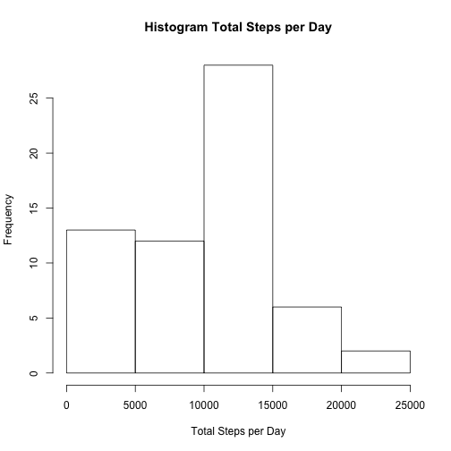
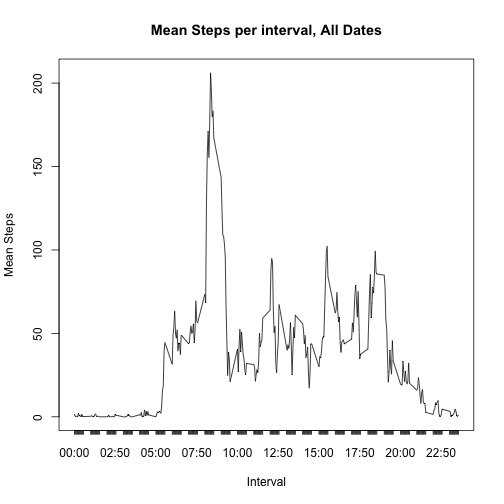
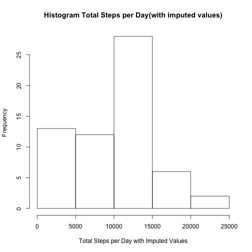
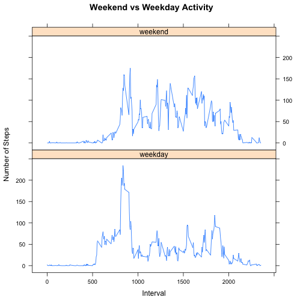

This Markdown document intends to take the reader through the process of completing the Project 1 analysis. 

# Loading and Preprocessing the Data

```r
#  No need to navigate to dircetory where data is downloaded
#  It won't be there for Git.  Assume it's in the working directory
# Here's how we do it anyway:
dataloc <- "/Users/Mark/Coursera/repres/project1"
setwd(dataloc)
wd <- getwd()
# Read data in wd:
 rawdata <- read.csv(unz("repdata_data_activity.zip", filename="activity.csv"))
 linecount <- format(nrow(rawdata),digits=2,big.mark=",",nsmall=2)
```
####WD is /Users/Mark/Coursera/repres/project1.
####The incoming data set has 17,568 lines.
## The data has been loaded into the dataframe <EM>rawdata</EM>
## This dataframe is largely a mirror of the Activity Monitoring Data specified  for the project. 

```r
strrawdata <- str(rawdata)
```

```
## 'data.frame':	17568 obs. of  3 variables:
##  $ steps   : int  NA NA NA NA NA NA NA NA NA NA ...
##  $ date    : Factor w/ 61 levels "2012-10-01","2012-10-02",..: 1 1 1 1 1 1 1 1 1 1 ...
##  $ interval: int  0 5 10 15 20 25 30 35 40 45 ...
```

##
#<HR>
# Mean Total Number of Steps per Day

```r
# from looking at rawdata, interval increases by 5 on each row
# the last entry for 10/1/12 has interval=2355 on line 288.  
# There are 12 5 minute intervals in each hour 
# 12*24 = 288 so it seems likely that each line represents a 5 minute interval
# But interval increase by 5 on each line, so you'd expect interval to be the 
# the ordinal for the minute of the day.
# But there are 24*60 = 1440 minutes in a day
# So how did the last entry for 10/1 get to be 2355?
# Looking at the first hour you'd expect it to end at line 12
# The  entry on line 12 has interval 55
# Line 13, which corresponds to the first interval of hour 2 has interval = 100
# it seems pretty clear that interval has the hour and minute  encoded in it
# Although I can't tell for sure,  you can get the time out of interval
# with floor(interval/100): mod(interval,100)
# This is kind of interesting.  Where does the 5 minute interval decision come from?
# Is that coded into the device by the manufacturer or some kind of consensus?
# Anyway, the assigment starts here
# 1. Total number of steps taken per day
stepsperday <- aggregate(rawdata$steps, by=list(rawdata$date),FUN=sum,na.rm=TRUE)
# aggregate did not preserve the name of the by group
colnames(stepsperday) [1] = "date"
colnames(stepsperday) [2] = "Total Steps"
# use kable to make this readable in knitr
library(knitr)
tspd <- kable(stepsperday)
# so stepsperday has our calculation 
# 
#3 Calculate and report the mean and median of the total number of steps taken per day
meanperday <- mean(stepsperday$"Total Steps")
medianperday <- median(stepsperday$"Total Steps")
# The next deliverables will be harder so use a new code chunk for them
```
##The total number of steps per day have been written to the dataframe <EM> stepsperday</EM>
## The Histogram of this data is

```r
# The histogram did not print when embedded in md but does print from r chunk so:
#2. make histogram of the steps per day.
exh2 <- hist(stepsperday$"Total Steps", main = "Histogram Total Steps per Day", xlab="Total Steps per Day")
```

 

```r
#pretty up mean and median
stmeanperday <- format(meanperday,digits=2,big.mark=",",nsmall=2)
stmedianperday <- format(medianperday,digits=2,big.mark=",",nsmall=2)
```
## The mean number of steps per day is 9,354.23.
## The median number of steps per day is 10,395.

### It might have been better to incorporate this on the histogram, but this meets the deliverable.<HR>
#Average Daily Activity Pattern

```r
# This is the time series plot for the time intervals
# A later chunk will be about imputing the missing values
# This will be important for that because the most reasonable 
# way to assign the missing values seems to be to use the average value for the
# the time intervals over the entire lifespan,  The early days may be when 
# the device is new and the user is not yet using it in a standard way.
# In fact on the first day (10/1/12) there are no non missing values at all
# We don't really know the full nature of the data source
# That knowledge would affect the approach we use.
# Sadly, that also introduces bias, but if we don't approach it with a plan 
# to achieve some understanding, there is no reason to do the analysis at all.
##
# For this part need to calculate teh time series
# Similar to above get mean by time interval:
stepsperint <- aggregate(rawdata$steps, by=list(rawdata$int),FUN=mean,na.rm=TRUE)
# rename the vars (aggregate changes the names)
# don't like the space in the name.
# Just call it Steps and we'll know it's the average
colnames(stepsperint) [1] = "Time"
colnames(stepsperint) [2] = "Steps"
# Just plot this to visually show time series, 
# of the 5-minute interval (x-axis) and the average number of steps taken, 
# averaged across all days (y-axis) as indicated in instructions.
# But Time is an integer so the x axis looks bad with just plot so try this:
# assume that interval variable is of the form {h}hmm and pretty it up to look like time
library(stringr)
attach(stepsperint)
```

```
## The following objects are masked from stepsperint (pos = 5):
## 
##     Steps, Time
```

```r
stepsperint$display <- paste(floor(Time/100),":",(Time %% 100))
stepsperint$display <- paste(str_pad(floor(Time/100),2,pad="0"),":",str_pad((Time %% 100),2,pad="0"))
stepsperint$display <- str_replace_all(stepsperint$display," ","")
#and plot it:
plot(stepsperint$Time,stepsperint$Steps,type="l",xaxt="n",ylab ="Mean Steps",xlab="Interval",main = "Mean Steps per interval, All Dates")
axis(1, at=stepsperint$Time, labels=stepsperint$display,tck =-.01)
```

 

```r
# print out actual mean values
printdf <- stepsperint[c(3,2)]
colnames(printdf) [1] <- "Time(interval)"
#identify the interval with the largest mean steps
maxi <- stepsperint[which.max(stepsperint$Steps),]
maxint <- maxi$Time
maxms <- maxi$Steps
```
##The  greatest average number of steps is 206.1698113 occurring at interval 835.
##
##The mean values for each interval that will be used to impute missing values are in the dataframe <EM>stepsperint</EM>.

```r
strspi <- str(stepsperint)
```

```
## 'data.frame':	288 obs. of  3 variables:
##  $ Time   : int  0 5 10 15 20 25 30 35 40 45 ...
##  $ Steps  : num  1.717 0.3396 0.1321 0.1509 0.0755 ...
##  $ display: chr  "00:00" "00:05" "00:10" "00:15" ...
```
### The Interval variable has been renamed Time and the variable display has been added to provide a readable form of the hour and minute of the interval in case the data needs to be printed or viewed.
## <HR>
#Imputing Missing Values
## The histogram below shows the distribution of steps per day after missing values have been imputed.

```r
# This section deals with missing values in the data
# Calculate and report the total number of missing values in the dataset 
totmiss <- format(sum(is.na(rawdata$steps)),digits=2,big.mark=",",nsmall=2)
# Devise a strategy for filling in all of the missing values in the dataset. 
# As noted above teh average value for each interval seems the most reasonable 
# way to imput the values
#Create a new dataset that is equal to the original dataset but with the missing data filled in
# stepsperint$Steps are the values for imputing.  Create a variable in rawdata 
# to hold imputed values
impdata <- rawdata
impdata$imputed <- stepsperint$Steps[match(impdata$interval,stepsperint$Time)]
# then replace missing values with imputed 
impdata$steps[is.na(impdata$steps)] <- impdata$imputed[is.na(impdata$steps)]
# that's it, now impdata has imputed values in steps field for missing steps
#NEXT: Make a histogram of the total number of steps taken each day and Calculate and report the mean and median total number
# sum to steps per day
impstepsperday <- aggregate(impdata$steps, by=list(impdata$date),FUN=sum)
#rename cols as we did for rawdata
colnames(impstepsperday) [1] = "date"
colnames(impstepsperday) [2] = "Total Steps"
exh2 <- hist(stepsperday$"Total Steps", main = "Histogram Total Steps per Day(with imputed values)", xlab="Total Steps per Day with Imputed Values")
```

 

```r
# mean,median
impmeanperday <- mean(impstepsperday$"Total Steps")
impmedianperday <- median(impstepsperday$"Total Steps")
# that's coming out as exponential so,
stimpmeanperday <- format(impmeanperday,digits=2,big.mark=",",nsmall=2)
stimpmedianperday <- format(impmedianperday,digits=2,big.mark=",",nsmall=2)
```
## In the original data there were 2,304 data points with missing steps.
## Total values of steps per day have been stored in the dataframe <EM>impstepsperday</EM>.
## This dataframe contains only the variables for the date and the total number of steps

```r
strimpspd <- str(impstepsperday)
```

```
## 'data.frame':	61 obs. of  2 variables:
##  $ date       : Factor w/ 61 levels "2012-10-01","2012-10-02",..: 1 2 3 4 5 6 7 8 9 10 ...
##  $ Total Steps: num  10766 126 11352 12116 13294 ...
```
## The mean number of steps per day with missing values imputed is 10,766.19
## The median number of steps per day with missing values imputed is 10,766.19
## The imputed values increase both the mean and the median, as is to be expected since the imputed values are always greater than missing.
## However the median now is equal to the total of all imputed values for a day.
## This indicates that we may have removed seasonality from the data when we imputed the missings.
## For the comparison of weekdays to weekends we should return to the data without the imputed values to reintroduce that seasonality.<HR>
#Comparing Weekend and Weekday Activity Patterns
## The plot below provides a comparison of the activity on weekends compared to the activity on weekdays,
## The simple plot of activity by Interval (time of day) split into weekend and weekday patterns indicates that more detailed analysis of these patterns may yield useful results, particularly if modification of total activity levels is desired. There appear to be substanstial differences in many, if not most, intervals. 


```r
# now comes the weekday vs weekend comparison:
#first assign names o weekday to each line 
rawdata$stday <- weekdays(as.Date(rawdata$date))

# now build the 2 panel comparison plots
# This can be done without splitting the data.   I am more comfortable with separate 
# data tables, but
# to do this with lattice it needs to be in one dataframe
rawdata$wdfact <- "weekday"
rawdata$wdfact[rawdata$stday == "Saturday" |rawdata$stday == "Sunday"] <- "weekend"
# calculate the averages
rolldata <- aggregate(rawdata$steps, by=list(rawdata$wdfact,rawdata$interval),FUN=mean,na.rm=TRUE)
#rename vars after aggregate
colnames(rolldata) [1] = "wdfact"
colnames(rolldata) [2] = "interval"
colnames(rolldata) [3] = "steps"
# wdfact must be a factor
rolldata$wdfact <- as.factor(rolldata$wdfact)
# should be easy from here
library(lattice)
attach(rolldata)
```

```
## The following objects are masked from rolldata (pos = 4):
## 
##     interval, steps, wdfact
```

```r
# after a lot of relearning lattice, seems like a simple scatterplot:
xyplot(rolldata$steps~rolldata$interval|rolldata$wdfact, 
       main="Weekend vs Weekday Activity", 
        ylab="Number of Steps", xlab="Interval",  type ="l",layout=c(1,2))
```

 
